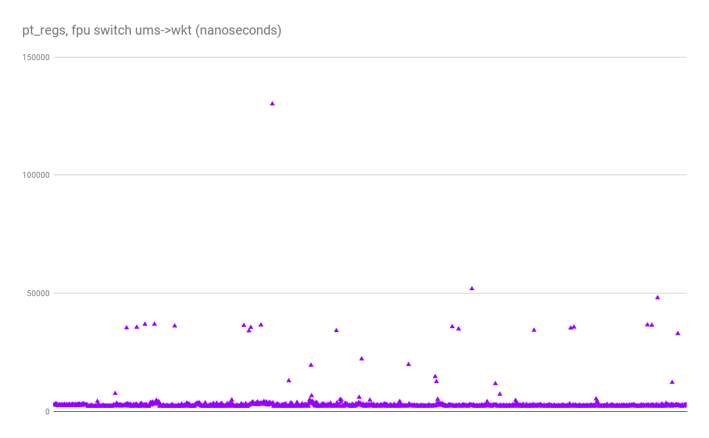
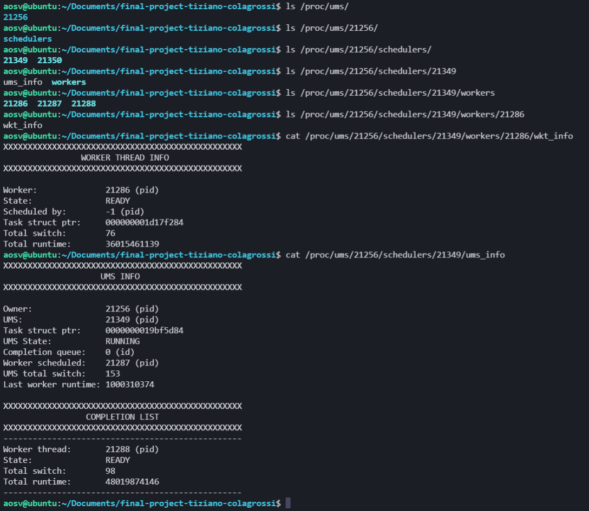
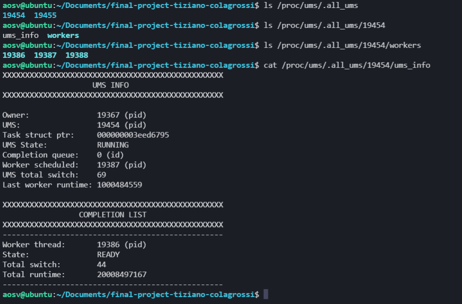
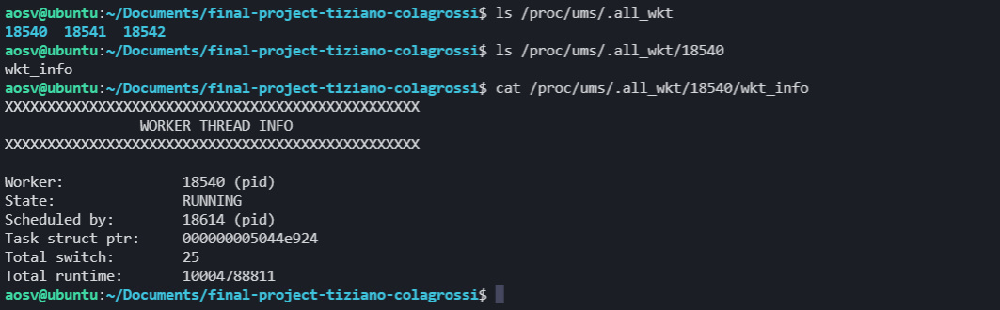
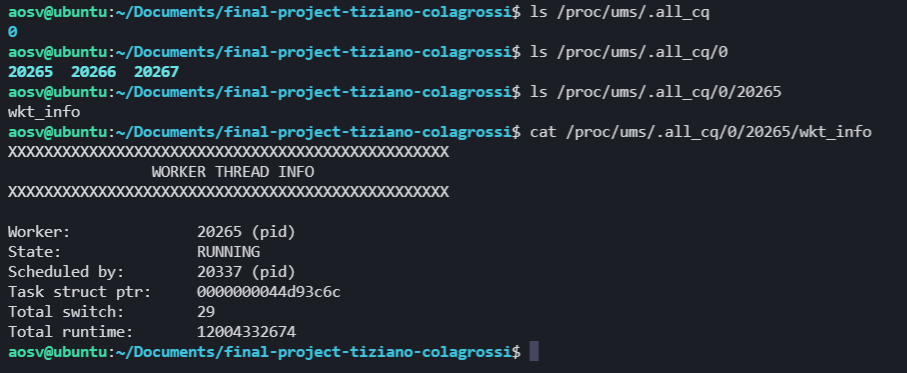

# AOSV Final Project Report
_A.Y. 2020/2021_

Author(s): Tiziano Colagrossi (1758113)

# Introduction
The final project of the course require to implement a **User Mode thread Scheduling** (UMS) 
facility makes able the programmer of a C user space application to schedule threads without 
involving the kernel scheduler.

For the project I chose to use the linux kernel version: **5.11.22**

The project is divided into two main part: the kernel_module and the user_library.

The **kernel module** handle the context switch from the UMS and the Worker thread, 
handle the statistics of the UMS thread and the Worker thread and managing the 
procfs in order to show the stats from the /proc/ums/... directory.

The **user library** instead contains the main function that call the ioctl of the 
ums device, but matain also some data structures in order to have better performance
in the completion queue append.

## Kernel module
The kernel module is composed by 6 separated section:
- module
- device
- shared
- ums
- proc
- utility
 
 Each section is unaware of the data structures of the other sections, 
 and the sections interface with each other only via exposed methods in 
 order to maintain a modularity to facilitate the maintenance of the module.

### Module (.c and .h)
This is the main section that glue all the other section togheter. 
It manages the insertion of the module into the kernel and the 
detachment of the module from the kernel.

And this calls in cascade the initializations of all other sections, 
during the opposite when the module is detached from the kernel

This is the init function for the Ums kernel module
this function glue all the part of this module
```c
static int ums_module_init(void){
        int err;

        printk(KERN_INFO MODULE_LOG "module loaded\n");
        err = try_start_device();
        if(err) goto fail_start_device;
        err = try_build_ums_core();
        if(err) goto fail_build_ums_core;
        err = try_build_ums_proc();
        if(err) goto fail_build_ums_proc;

        return EXIT_SUCCESS;

fail_build_ums_proc:
        clear_ums_proc();
fail_build_ums_core:
        clear_ums_core();
fail_start_device: 
        stop_device();

        return EXIT_FAILURE;
}
```

This handle the detachment of the module from the kernel
```c
static void ums_module_exit(void){
        clear_ums_proc();
        clear_ums_core();
        stop_device();
        printk(KERN_INFO MODULE_LOG "module unloaded\n");
}
```


### Device (.c and .h)
This section contain the master switch for the ioctl call. Here the device is 
registered as misc_device and this file works closely with the ```shared.h```
file that contain the definition for the ioctl calls.

This is the function that switch the request from the users
```c
static long ums_ioctl(struct file *file, unsigned int request, unsigned long data){
        int err; 
        int retval = 0;

        /*
        * extract from the ioctl request the magic number and the request
        * wrong requests: return ENOTTY (inappropriate ioctl) before access_ok( )
        */
        if (_IOC_TYPE(request) != UMS_IOC_MAGIC) return -ENOTTY;
        if (_IOC_NR(request)    > UMS_IOC_MAXNR) return -ENOTTY;

        /*
        * check correctness of the address
        */
        err = !access_ok((void __user *)data, _IOC_SIZE(request));
#ifdef UMS_DEV_DEBUG
        printk(KERN_DEBUG MODULE_DEV_LOG "check access_ok %d", err);
#endif
        if (err) return -EFAULT;

#ifdef UMS_DEV_DEBUG
        printk(KERN_DEBUG MODULE_DEV_LOG "IOCTL %s issued by %d\n",
                cmds[_IOC_NR(request)], current->pid);
#endif

        // checks are ok
        switch (request)
        {
        case UMS_IOCRESET:
                break;
        case UMS_IOC_THREAD_YIELD:
                retval = yield_to_ums(ioctl_spinlock);
                break;
        case UMS_IOC_THREAD_EXECUTE:
                retval = execute_wkt(ioctl_spinlock, (unsigned *) data);
                break;
...
        case UMS_IOC_DEQUEUE_COMPLETION_LIST:
                retval = dequeue_cq(ioctl_spinlock,(ums_cq_param_t *) data);
                break;
        default:
                retval = EXIT_FAILURE;
                break;
        }
        
        return retval;
}
```


### Shared (.h)
This header contain all the information that need to be shared between 
user library and kernel module, such as the definition of the ioctl commands
or the data structired used between the library and the module.

ioctl cmd definitions.
```c
...
#define UMS_IOC_END_UMS_SCHEDULER          _IO  (UMS_IOC_MAGIC, 4)
#define UMS_IOC_INIT_WORKER_THREAD         _IO  (UMS_IOC_MAGIC, 5)
#define UMS_IOC_END_WORKER_THREAD          _IO  (UMS_IOC_MAGIC, 6)
...
```
Shared data structures.
```c
typedef struct ums_km_param{
	int 	cq_id; /**< id of the completion queue that will be used by the ums*/
	int owner_pid; /**< process that has request the creation of the ums*/
}ums_km_param_t;

typedef struct ums_cq_param{
	int         completion_queue_id; /**< id of the completion queue */
	int pids[COMPLETION_QUEUE_BUFF]; /**< array with pid of the worker threads*/
}ums_cq_param_t;
```

### Ums (.c and .h)
This is the core of the module. Inside this file there are all the function 
that handle the ioctl request and so the context switch betwen ums and worker threads.

The **context switch is implemented in two ways**:
1. Using the ```pt_regs``` and ```fpu``` struct of the task_struct
2. Using the ```schedule()``` function and the ``` __set_current_state()``` macro

The first method work only if the task_struct mm entry is the same (so if the threads 
share the same memory map). Instead the second metod work for all the case since no
handling of the register is performed.

by declaring: ```#define SWITCH_PT_REGS``` inside teh ```ums.h``` header the 
module perform the 1st method, if this is not declared the module will perform
the 2nd method.

example of the multiple switch method supported  
```c
int execute_wkt(spinlock_t ioctl_lock, unsigned * u_wkt_pid)
{
...

#ifdef SWITCH_PT_REGS
        memcpy(&ums_caller->saved_pt_regs, task_pt_regs(current), sizeof(struct pt_regs));
        memcpy(task_pt_regs(current), &wkt_to_switch->saved_pt_regs, sizeof(struct pt_regs));

        fxsave(&ums_caller->saved_fpu_regs);
        fxrestore(&wkt_to_switch->saved_fpu_regs);
#endif 

...

#ifndef SWITCH_PT_REGS
        __set_current_state(TASK_INTERRUPTIBLE);
        wake_up_process(wkt_to_switch->task_struct);
        schedule();
#endif 
...
}
```

Inside this file there are also the management of the completion queue 
and the mantaining of the stats for the ums and the worker.

The completion queue are identified by its own id. This id is generated
by searching into a bitmap that trace all the completion queue currently 
existing.

### Proc (.c and .h)

This section handle the exposure of the stats for the UMS, the completion
queue and for the worker threads.

Mainly this section exposes functions that are called by the ums section. 
these functions correspond to events that affect the proc section.

Those are the function that propagate the "events" on which proc is interested
```c
int Proc_Update_Worker_Created  (int pid    );
int Proc_Update_Worker_Ended    (int wkt_pid);
int Proc_Update_Worker_Appended (int wkt_pid , int id      );
int Proc_Update_Ums_Created     (int pid     , int pid_owner, int id);
int Proc_Update_Ums_Ended       (int ums_pid);
int Proc_Update_Cq_Created      (int id     );
int Proc_Update_Cq_Deleted      (int id     );
```

The info in the proc fs are exposed in this way:
- ```/proc/ums/``` ums module folder
- ```/proc/ums/.all_wkt``` folder with all the worker thread 
- ```/proc/ums/.all_ums``` folder with all the ums
- ```/proc/ums/.all_cq``` folder with all the completion queue
- ```/proc/ums/<owner_pid>/schedulers/<ums_pid>``` folder of the ums scheduler where teh pwner pid if the pid of the thread that has created the ums. So if a LWP create multiple ums, those will be all in the same ```owner_pid``` folder
- ```/proc/ums/<owner_pid>/schedulers/<ums_pid>/ums_info``` this is the file that contain all the stats of the ums
- ```/proc/ums/<owner_pid>/schedulers/<ums_pid>/workers/``` this folder contain all the worker thread contained in the completion queue of the ```<ums_pid>``` ums scheduler
- ```/proc/ums/<owner_pid>/schedulers/<ums_pid>/workers/<wkt_pid>/wkt_info``` this is the file that contain all the stats of the worker thread with pid ```<wkt_pid>```

### Utility (.h)

This file contain some macro that are useful in the module
for example:

```c
/**
 * @brief retrive a node in an hlist by its identifier
 *
 * @param item_select		will be filled with the retrived node
 * @param head			the head of the list
 * @param member    		the &struct list_head of the object to be retrived
 * @param member_identifier	the name of the identifier within the struct
 * @param identifier		the key of the object to find
 */
#define retrive_from_list(item_select, head, member, member_identifier, identifier)\
	list_for_each_entry(item_select, head, member) {\
		if (item_select->member_identifier != identifier) continue;\
		break;\
	}
```

## User Module
The user library is only one file. The function that this library expose are the following:
```c
int CreateNewWorker(worker_job job_to_perform, void * job_args);

int UmsThreadYield(void);
int ExecuteUmsThread(unsigned worker_id);

pthread_t UMS_thread_create(ums_entry_point entry_point, int completion_queue_id, int n_cpu);

ums_t * EnterUmsSchedulingMode(ums_entry_point entry_point, int completion_queue_id);
void ExitFromUmsSchedulingMode(ums_t * ums);

int CreateCompletionQueue(void);
int AppendToCompletionQueue(int completion_queue_id, int worker_pid);
int FlushCompletionQueue(int completion_queue_id);
int DequeueUmsCompletionListItems(dequeued_cq_t * return_cq);
```

### CreateNewWorker
```c
int CreateNewWorker(worker_job job_to_perform, void * job_args);
```

This function create a new worker that will perform the ```job_to_perform``` given (if required) the ```job_args```.
Here an example:
```c
struct testJobArgs{
    int a;
    int b;
};

void *testJob1(void *arguments){
    struct testJobArgs *args = (struct testJobArgs *)arguments;
    printf(T1 "testJob args a %d b %d\n", args->a, args->b);
    return NULL;
}

int main(int argc, char **argv){
    struct testJobArgs myJobArgs1;
    myJobArgs1.a = 10;
    myJobArgs1.b = 20;
    int pid_wkt1 = CreateNewWorker(&testJob1, (void *)&myJobArgs1);
}

```

This function return the pid of the worker (pthread) that will be create and will be run only when the UMS schedule it.

The function ```CreateNewWorker``` call the function ```pthread_create``` giving as entry point the function ```__worker_thread_job_wrapper```
and as arguments the struct ```worker_thread_job_info_t``` that is defined ad follows

```c
typedef struct worker_thread_job_info {
	worker_job           job; /**< poiner to the job (finction) of the worker thread*/
	void *      args_routine; /**< pointer to the args of the job*/
	int  		     pid; /**< pid of the worker thread*/
} worker_thread_job_info_t;
```

in the ```__worker_thread_job_wrapper``` function the worker thread is initialized by invoking the kernel using an ioctl syscall
then the funtion perform:

```c
w_args->job(w_args->args_routine);
```
that is responsible to run the job, and finally it call another ioctl syscall for end the worker at kernel level.


### CreateCompletionQueue

```c
int CreateCompletionQueue(void);
```

This function is only an ioctl syscall wrapper for the command ```UMS_IOC_INIT_COMPLETION_QUEUE``` it return the **id** of the new completion queue created. Or negative values in case of error.

### AppendToCompletionQueue
```c
int AppendToCompletionQueue(int completion_queue_id, int worker_pid);
```

This function handle the append to a completion queue requests. In order to optimize the performance there is a buffer that will mantain the 
append request till a ```FlushCompletionQueue``` is called or the buffer for a completion queue is full. 

This function use the list structures defined in the kernel. And for this there is the file ```list.h``` this file is a copy and paste of the list implemented in kernel module only lightly modified in order to work in user space.


### FlushCompletionQueue
```c
int FlushCompletionQueue(int completion_queue_id);
```

This function pass buffer of worker_pid to the kernel in order to append the worker thread in the kernel module.

### DequeueUmsCompletionListItems
```c
int DequeueUmsCompletionListItems(dequeued_cq_t * return_cq);
```

**This function can be used only by an UMS scheduler thread**

This function return a buffer filled with at most COMPLETION_QUEUE_BUFF size.

### UmsThreadYield
```c
int UmsThreadYield(void);
```

**This function can be used only by a Worker thread**

This function is only an ioctl syscall wrapper for the command ```UMS_IOC_THREAD_YIELD``` that perform the yield from the worker thread to the ums scheduler.

### ExecuteUmsThread
```c
int ExecuteUmsThread(unsigned worker_id);
```

**This function can be used only by an UMS scheduler thread**

This function is only an ioctl syscall wrapper for the command ```UMS_IOC_THREAD_EXECUTE``` that schedule if possible the worker required.

### UMS_thread_create
```c
pthread_t UMS_thread_create(ums_entry_point entry_point, int completion_queue_id, int n_cpu);
```

This function create an UMS scheduler by calling ```pthread_create``` giving as entry point the function ```__ums_entry_point_wrapper```
and as arguments the struct ```new_ums_info``` that is defined ad follows

```c
typedef struct ums_entry_info {
	ums_entry_point    entry; /**< entry point function*/
	int 	           cq_id; /**<*id of the completion queue used*/
	int 	       owner_pid; /**< pid of the owner of the ums*/
	int 	       ret_value; /**< ret value of the initialization*/
} ums_entry_info_t;
```

in the ```__ums_entry_point_wrapper``` function the UMS scheduler thread is initialized by invoking the kernel using an ioctl syscall
then the funtion perform:

```c
ums_args->entry(NULL);
```
that is responsible to run entry point of the UMS scheduler.

The function ```EnterUmsSchedulingMode``` also bind the ums thread to the core specofied by the param **n_cpu** using the function ```pthread_attr_setaffinity_np```.


### EnterUmsSchedulingMode
```c
ums_t * EnterUmsSchedulingMode(ums_entry_point entry_point, int completion_queue_id);
```

This function will create N UMS scheduler thread with N the number of the cpu core present in the computer used.
It take as input an ```ums_entry_point``` (if null will be used the default entry point defined in the ums library),
and the ```completion_queue_id``` that contain the worker thread.

### ExitFromUmsSchedulingMode
```c
void ExitFromUmsSchedulingMode(ums_t * ums);
```
 
This is the function that will call ```pthread_join``` to all the UMS scheduler thread of the ums and after will free all the data structure that the library has created if needed.

# Results

## switch strategy
### pt_regs strategy

Using the pt_regs trategy for the switch this is the time measurement:

Time enter is from worker to ums (so the switch with the yield)
```
SCHEDULE: start time enter

SCHEDULE: 0.000001900 sec
SCHEDULE: 0.000001590 sec
SCHEDULE: 0.000001630 sec
SCHEDULE: 0.000001560 sec
SCHEDULE: 0.000001550 sec
SCHEDULE: 0.000001630 sec
```

Time exit is from ums to worker (so the switch with the execute)
```
SCHEDULE: start time exit

[thread time] 0.000002550 sec
[thread time] 0.000002460 sec
[thread time] 0.000002480 sec
[thread time] 0.000002550 sec
[thread time] 0.000002340 sec
[thread time] 0.000002330 sec
```

we can see that the yield is a bit more faster than the execute this because the execute perform more check and need to find the worker thread struct, instead when a yield is issued the struct of the worker thread is saved into the ums sceduler thread.

```c
typedef struct ums_scheduler {

        worker_thread_t *    wkt_sched_struct;  /**< datastructire of the wkt scheduled*/
...
} ums_scheduler_t;
```

so we have 1,64 microsec for the yield and 2.45 microsec for the execute in the case of this strategy.


this is a scatterplot of 1000 switch caused by an execute (time in nanosecond)


this is a scatterplot of 1000 switch caused by a yield (time in nanosecond)


### schedule() strategy
Instead the time with the other strategy are:

Time enter is from worker to ums (so the switch with the yield)
```
SCHEDULE: start time enter

SCHEDULE: 0.000079050 sec
SCHEDULE: 0.000066169 sec
SCHEDULE: 0.000065598 sec
SCHEDULE: 0.000060199 sec
SCHEDULE: 0.000066114 sec
SCHEDULE: 0.000082767 sec
```

Time exit is from ums to worker (so the switch with the execute)
```
SCHEDULE: start time exit

[thread time] 0.000062066 sec
[thread time] 0.000054475 sec
[thread time] 0.000061490 sec
[thread time] 0.000062130 sec
[thread time] 0.000083569 sec
[thread time] 0.000060110 sec
```
and we have 69,99 microsec for the yield and 63,97 microsec for the execute in the case of this strategy.


this is a scatterplot of 1000 switch caused by an execute (time in nanosecond)


this is a scatterplot of 1000 switch caused by a yield (time in nanosecond)

## procfs exposure







# Conclusions

So basically this kernel module support User Mode Scheduling with time of switching from a worker thread 
to another in 4.09 microsecond using the pt_regs switch (that is the fastest), the concurrency is handled 
by imposing to the device to perform only one action at time (since this is my first kernel module).

 

# References

- [Ioctl structure on kernel](https://www.oreilly.com/library/view/linux-device-drivers/0596005903/ch06.html) 
- [task_struct on elixir](https://elixir.bootlin.com/linux/v5.11.22/source/include/linux/sched.h#L649) 
- [Proc API](https://elixir.bootlin.com/linux/v5.11.22/source/include/linux/proc_fs.h#L109) 
- [Fpu API (all file not fpu__copy)](https://elixir.bootlin.com/linux/v5.11.22/source/arch/x86/include/asm/fpu/internal.h#L34) 
- [Schedule](https://elixir.bootlin.com/linux/v5.11.22/source/kernel/sched/core.c#L5145) 
- [Lesson AOSV](https://gpm.name/teaching/2021-aosv/) 
- [generic info](https://embetronicx.com/tutorials/linux/device-drivers/linux-device-driver-part-1-introduction/) 
- [char drivers](https://static.lwn.net/images/pdf/LDD3/ch03.pdf) 
- [ioctl](https://static.lwn.net/images/pdf/LDD3/ch06.pdf) 
- [set affinity](https://stackoverflow.com/questions/1407786/how-to-set-cpu-affinity-of-a-particular-pthread) 
- I have read some kernel module project in order to acquire useful pattern 
Used a lot!
- [Google](https://www.google.com/) 
